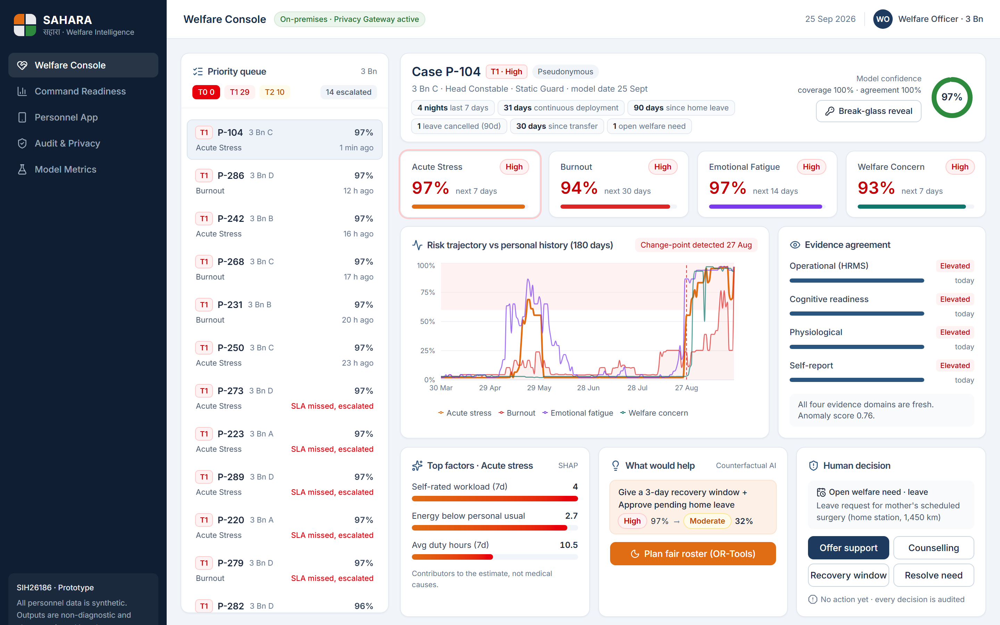
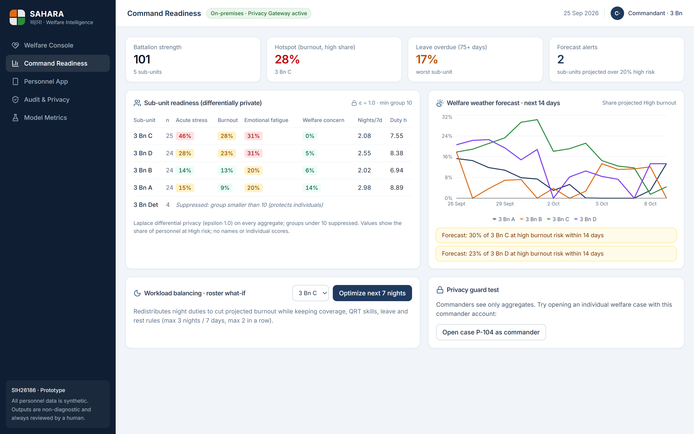
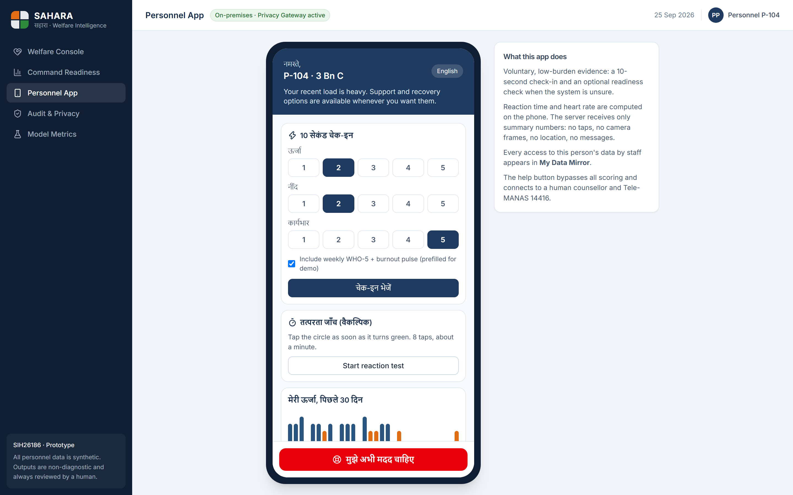
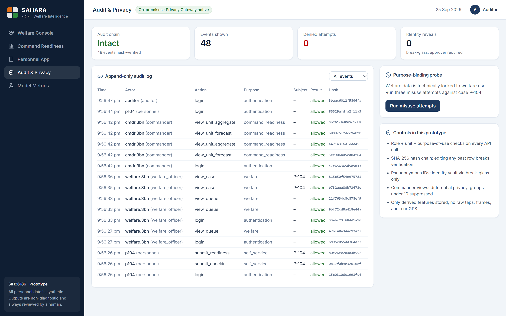

<div align="center">

# SAHARA सहारा

**Stress-Aware Health And Resilience Analytics**

AI-based predictive personnel stress and welfare monitoring for uniformed forces

Smart India Hackathon 2026 · **SIH26186** · Ministry of Home Affairs · MedTech / BioTech / HealthTech · Software

Team **TribeCoders** (Team ID 144977)


</div>

---

## The problem

Between 2020 and 2024, **730** personnel of the CAPFs, NSG and Assam Rifles died by suicide and
**55,555** left service through voluntary retirement or resignation
([MHA, Rajya Sabha Unstarred Q.1036, 4 Dec 2024](docs/references/MHA_RS_Q1036_2024-12-04.pdf)).
Welfare today relies on manual observation and self-reporting, which often notices strain only
after a crisis.

## What SAHARA does

SAHARA predicts **acute stress, burnout, emotional fatigue and welfare concerns** early, from HRMS
data and voluntary app input, and turns every alert into human-led support.

**Sense → Protect → Predict → Alert → Act → Recover**

- **Personal baselines, not fixed cut-offs.** Each person is compared with their own normal, with
  cold-start fallback for new joiners.
- **Four calibrated risk models** (XGBoost), each with its own horizon, band and confidence.
- **Adaptive evidence.** When the model is unsure, it asks the person for one optional 90-second
  check instead of alerting staff. In the demo, confidence rises from 40% to 97%.
- **Explainable and actionable.** SHAP factors plus counterfactual "what would help" advice, linked
  to an OR-Tools fair-roster optimizer.
- **Tiered alerts** with response deadlines and automatic escalation, plus a **crisis route** to a
  counsellor and Tele-MANAS 14416 that bypasses all scoring.
- **Welfare, never surveillance or discipline.** Purpose-locked data, differential-privacy
  commander views, pseudonymous IDs, a tamper-evident audit log, and **My Data Mirror** so
  personnel see every access to their data.

## Screenshots

| Welfare Officer Console | Command Readiness |
|---|---|
|  |  |
| **Personnel App (Hindi)** | **Audit & Privacy** |
|  |  |

## Quick start

Requirements: Python 3.12, Node.js 20+. Commands below are for Windows PowerShell; on macOS or Linux
use `.venv/bin/python` instead of `.venv\Scripts\python`.

```powershell
# 1. Backend
cd backend
python -m venv .venv
.venv\Scripts\pip install -r requirements.txt
.venv\Scripts\python -m scripts.seed          # synthetic data + model training + alerts (~35 s)
.venv\Scripts\python -m uvicorn app.main:app --port 8000

# 2. Frontend (second terminal)
cd frontend
npm install
npm run dev                                    # http://localhost:5173

# 3. Stage the demo scenario (API running)
cd backend
.venv\Scripts\python -m scripts.demo_flow      # P-104: confidence 40% -> 97%, T1 alert
```

Open **http://localhost:5173** (API docs at **http://localhost:8000/docs**).

Run the tests: `cd backend; .venv\Scripts\python -m pytest -q tests`

## Screens

| Screen | Demo user | Highlights |
|---|---|---|
| Welfare Console | `welfare.3bn` | Priority queue, 4 risks, confidence, evidence agreement, risk trajectory with change-point, SHAP factors, "what would help", fair-roster plan, break-glass reveal |
| Command Readiness | `cmdr.3bn` | Differential-privacy sub-unit readiness, suppressed small groups, 14-day forecast, roster what-if, 403 on individual data |
| Personnel App | `p104` | Hindi / English, 10-second check-in, reaction-time test, consent controls, My Data Mirror, help button |
| Audit & Privacy | `auditor` | Hash-chain verification, purpose-binding misuse probe |
| Model Metrics | `welfare.3bn` | Held-out results, baselines, fairness audit |

## Results (synthetic data, held-out personnel)

| Risk | Horizon | AUROC | PR-AUC | HRMS-only PR-AUC |
|---|---|---|---|---|
| Acute stress | 7 days | 0.97 | 0.79 | 0.53 |
| Burnout | 30 days | 0.82 | 0.60 | 0.46 |
| Emotional fatigue | 14 days | 0.94 | 0.73 | 0.51 |
| Welfare concern | 7 days | 0.86 | 0.75 | 0.13 |

These numbers show the pipeline works; real-world accuracy requires a governed pilot with force
data. See the [model card](docs/MODEL_CARD.md) for method, baselines and limitations.

## Tech stack

| Layer | Technology |
|---|---|
| Frontend | React 19, Vite, Tailwind CSS, Recharts, lucide-react |
| Backend | Python 3.12, FastAPI, Pydantic, SQLAlchemy, JWT |
| Data | SQLite (prototype), PostgreSQL (production) |
| AI / ML | XGBoost, scikit-learn (isotonic calibration, Isolation Forest), SHAP, ruptures |
| Optimisation | Google OR-Tools CP-SAT |
| Privacy / security | Role + unit + purpose checks, differential privacy, SHA-256 hash-chained audit |
| Quality | pytest (14 tests), GitHub Actions CI, rotating logs, global error handling |

## Repository structure

```
SIH-SAHARA/
├── backend/
│   ├── app/
│   │   ├── core/          config, database, logging, errors, security
│   │   ├── ml/            synthetic generator, features, risk engine
│   │   ├── services/      risk, alerts, roster, privacy, audit, repository
│   │   ├── routers/       personnel, welfare, commander, admin
│   │   ├── models.py      workflow tables
│   │   └── schemas.py     validated request bodies
│   ├── scripts/           seed.py, demo_flow.py
│   ├── tests/             end-to-end, privacy and security tests
│   └── requirements.txt
├── frontend/
│   ├── public/            favicon
│   └── src/
│       ├── api/           API client
│       ├── components/    shared UI
│       ├── lib/           formatting helpers
│       └── views/         the five screens
├── docs/
│   ├── ARCHITECTURE.md  API.md  MODEL_CARD.md  DEMO_GUIDE.md
│   ├── screenshots/
│   ├── submission/        idea deck (PDF) and PRD (PDF)
│   └── references/        official MHA source
├── tools/
│   ├── screenshots.ps1
│   └── submission-builder/  regenerates the deck and PRD
└── .github/workflows/ci.yml
```

## Documentation

- [Architecture](docs/ARCHITECTURE.md): system design, risk model, alert tiers, privacy controls, production path
- [API reference](docs/API.md): endpoints, roles, error format
- [Model card](docs/MODEL_CARD.md): data, features, results, fairness, limitations
- [Demo guide](docs/DEMO_GUIDE.md): reset steps and the 7-minute walkthrough
- [Idea deck](docs/submission/SAHARA_SIH26186_Idea_Presentation.pdf) · [PRD](docs/submission/SAHARA_PRD_v2.0.pdf)

## Responsible AI

All data in this repository is **synthetic**. Outputs are **non-diagnostic** and every alert is
reviewed by a human. SAHARA never reads chats, calls or social media, never tracks GPS or uses the
camera for surveillance, never performs face or emotion recognition, never feeds discipline or ACR,
and never sends personnel data to a public cloud or LLM.

## License

[MIT](LICENSE) © 2026 TribeCoders
