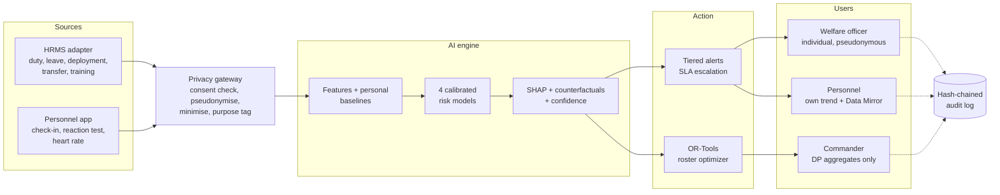

# Architecture

SAHARA is a closed-loop welfare system: **sense → protect → predict → alert → act → recover**.
Every individual prediction goes to a human welfare officer; commanders only ever see
privacy-protected unit aggregates.

## System overview

## Backend layout (`backend/app`)

| Package | Responsibility |
|---|---|
| `core/` | Configuration, database session, logging (rotating `app.log` + `error.log`), global error handlers, authentication and access checks |
| `ml/generator.py` | Synthetic personnel: 300 people × 180 days, hidden strain state, noisy and missing observations |
| `ml/features.py` | 37 features: 20 operational (HRMS) indicators and 17 individual signals compared with each person's robust personal baseline, with cold-start shrinkage |
| `ml/engine.py` | Training, isotonic calibration, SHAP explanations, counterfactual "what would help", confidence scoring, anomaly and change-point detection |
| `services/` | Business logic: risk snapshots, alert tiers, roster optimisation, differential privacy, audit chain, data access |
| `routers/` | HTTP API: personnel, welfare, commander, admin |
| `models.py` / `schemas.py` | Workflow tables (alerts, consents, needs, audit, identity vault) and validated request bodies |

## Risk model

| Dimension | Horizon | Meaning |
|---|---|---|
| Acute stress | 7 days | Short-term strain above the person's own baseline |
| Burnout | 30 days | Sustained exhaustion built up over weeks |
| Emotional fatigue | 14 days | Wearing down of wellbeing, family separation effects |
| Welfare concern | 7 days | Unmet practical needs (leave, family, housing, finance) |

Each dimension is an XGBoost classifier with isotonic calibration. Bands: Low < 30%, Moderate 30–60%,
High ≥ 60%. Probabilities are clipped to 2–97% so the system never claims certainty.

**Confidence** is separate from risk. It combines how fresh each evidence domain is (operational,
cognitive, physiological, self-report), whether the domains agree, and the model's margin. Low
confidence triggers an optional readiness check for the person instead of an alert to staff.

## Alert tiers

| Tier | Condition | Recipient | Acknowledge within |
|---|---|---|---|
| T0 Crisis | Help button, urgent-support answer, very low WHO-5 | Counsellor + welfare officer | 30 minutes |
| T1 High | High risk, confidence ≥ 60%, sustained 3 days | Welfare officer | 24 hours |
| T2 Moderate | Moderate+ risk, confidence ≥ 50% | Welfare officer | 72 hours |
| T3 Evidence request | Rising risk but low confidence | The person only (optional check) | Never escalates to staff |

Unacknowledged alerts escalate automatically (for example T1 → Senior Welfare Officer).

## Privacy and security controls

| Control | Where |
|---|---|
| Role + unit + purpose-of-use checks on every call; denials are logged | `core/security.py` |
| Welfare data refused for any non-welfare purpose (e.g. disciplinary) | `require(..., purpose="welfare")` |
| Pseudonymous IDs; real identity only through break-glass reveal with approver | `routers/welfare.py`, `IdentityVault` |
| Differential privacy (Laplace, ε = 1.0) and suppression of groups under 10 on commander views; noise is deterministic per query to block averaging attacks | `services/privacy.py` |
| SHA-256 hash-chained, append-only audit log, serialised writes | `services/audit.py` |
| My Data Mirror: personnel see every access to their data | `GET /v1/me/access-log` |
| Only derived features leave the phone (no raw taps, frames, audio or location) | `schemas.ReadinessIn` |

## Production path

| Prototype | Production |
|---|---|
| SQLite | PostgreSQL (`SAHARA_DB_URL`) with row-level security |
| Demo username login | Force OIDC identity provider + MFA |
| In-process lock on audit writes | PostgreSQL advisory lock |
| Synthetic data | Governed pilot with force psychologists and ethics approval |
| Local servers | Force data centre or MeghRaj (Government of India cloud), no public LLM |
